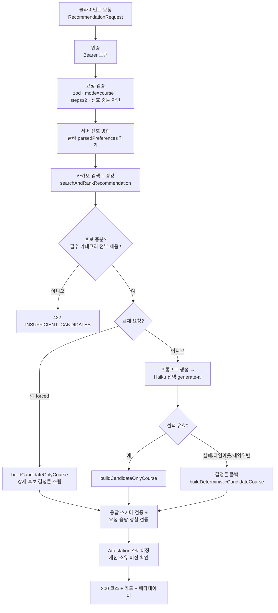

# AI 데이트 추천 아키텍처 — 기능 명세

> 최종 갱신: 2026-07-19 (부적합 장소 필터 반영)
> 대상: `recommend-date` · `replacement-candidates` Supabase Edge Functions 및 공유 모듈
> 원칙: **결정론 우선, LLM은 "선택"만.** 장소 사실(이름·좌표·주소·URL)은 카카오가 유일 원천이고 LLM은 검증된 후보 중 고르기만 한다.

---

## 1. 전체 흐름



핵심: **검색·랭킹·조립은 전부 결정론**이고, LLM 호출은 단 한 번(코스 스텝별 후보 선택)뿐이다. LLM이 실패해도 결정론 폴백으로 항상 코스가 나온다.

---

## 2. 진입점

| 함수 | 역할 | 핸들러 |
|---|---|---|
| `recommend-date` | 최초 코스 추천 | `recommend-date-handler.ts` `handleRecommendDate` |
| `replacement-candidates` | 특정 스텝 교체 대안 목록 | `replacement-candidates/index.ts` |

둘 다 `searchAndRankRecommendation`(`recommendation-search-pipeline.ts`)을 공유한다 → **검색·랭킹·필터 로직이 한 곳**이라 정책 변경이 양쪽에 동시 반영된다.

---

## 3. 요청 검증 · 신뢰 경계

`handleRecommendDate` 순서 (`recommend-date-handler.ts`):

1. `OPTIONS` → 204, 비-`POST` → 405.
2. `Authorization` 없으면 401 `AUTH_EXPIRED`. `authenticate()`로 유저 확인.
3. `recommendationRequestSchema.safeParse` — 실패 시 400 `INVALID_INPUT`.
4. `mode === 'course'` && `courseSteps.length >= 2` 아니면 400.
5. `detectStructuredPreferenceConflict` — 구조화 선호 모순 시 400.
6. **신뢰 경계**: 클라이언트가 보낸 `parsedPreferences`는 **폐기**(`_untrustedParsedPreferences`)하고, 서버가 `mergeServerPreferences`로 다시 계산한 값만 사용. → 클라가 선호를 위조해 사실을 조작하지 못함.

---

## 4. 카카오 검색 (사실의 유일 원천)

### 4.1 검색 계획 `buildKakaoSearchPlan` (`recommendation-search.ts`)

코스 스텝 카테고리 → 카카오 질의로 매핑:

| 카테고리 | 카카오 질의 |
|---|---|
| meal / restaurant | 카테고리 `FD6` |
| cafe | 카테고리 `CE7` |
| culture | 카테고리 `CT1` |
| walk / attraction | 카테고리 `AT4` |
| drinks / bar | 키워드 `술집` |
| activity | 키워드 `액티비티` |
| ai_decide | 키워드 `데이트 장소` |

추가 질의: 사용자 자유입력(`additionalRequest`, **explicit phase**), 의도 보강(`데이트 코스`), 폴백(`주변 데이트 장소`).

검색 한도(`KAKAO_SEARCH_LIMITS`): 최대 12요청, 페이지당 15건, 질의당 최대 2페이지, 타임아웃 4초, 고유 후보 12~40.

### 4.2 크로스 유저 캐시 (`kakao-search-cache.ts`)

- 좌표를 **0.005°(~500m) 격자**로 스냅 → 근처 유저끼리 캐시 공유.
- `cache_key = endpoint|검색어|격자위도|격자경도|page`, `documents`(jsonb) 저장, **30일 TTL**.
- `service-role`만 접근(RLS로 anon/authenticated 차단).
- hit → 카카오 API 스킵(즉시 반환), miss → 카카오 호출 후 저장(`EdgeRuntime.waitUntil`로 비동기 기록, 쓰기가 검색을 절대 안 막음).
- **explicit phase(자유입력) 질의는 캐시 안 함** — 개인 텍스트 크로스 유저 저장 금지.

### 4.3 정규화 · 증거 `EvidencedKakaoPlace`

카카오 문서 → `normalizeDocument`로 좌표 유효성·필수필드 검증 후 정규화. 같은 장소가 여러 질의에 등장하면 `matchedSearchEvidence` 배열로 병합(어떤 질의·페이지에서 나왔는지 추적). 보존 필드: `kakaoPlaceId · name · categoryGroupCode · categoryGroupName · categoryName · address · roadAddress · lat/lng · mapUrl`.

---

## 5. 랭킹 · 후보 선별 (`recommendation-ranking.ts`)

### 5.1 적합성 필터 `eligiblePlaces`

후보에서 다음을 **제거**한다:

1. `excludedPlaceIds`에 든 장소 (교체 시 재등장 방지).
2. **`isUnfitDatePlace(place)` — 부적합 장소 (2026-07-19 추가).** 아래 §6.
3. `excludedCategories`에 매칭되는 장소(`verifiedPlaceMatchesCategory`).

이 필터가 **후보 명단이 만들어지기 전 단계**라, 제거된 장소는 랭킹·프롬프트·LLM 어디에도 나타나지 않는다.

### 5.2 점수화 `scoreBreakdown` (가중치 `RANKING_SCORE_WEIGHTS`)

| 항목 | 값 | 근거 |
|---|---|---|
| `intent` | 40 / 20 / 0 | 필수 카테고리 매칭 40, explicit 키워드 증거 20, 그 외 0 |
| `distance` | 최대 20 | 검색 중심에서 250m당 -1 |
| `routeFit` | 최대 10 | 다른 필수 카테고리 후보와의 직선 근접(500m당 -1) |
| `diversity` | 5 | 카테고리별 대표 후보 recall 보정 |
| `budget`·`preference`·`behavior`·`penalty` | 0 | **현재 미사용(빈 슬롯).** 향후 확장 지점 |

> `behavior`/`preference`는 의도적으로 0. 무료 카카오엔 품질 신호(별점·리뷰)가 없어 근거 없는 점수를 만들지 않는다. → §8 후속 B안.

### 5.3 Recall 보장 + 한도

카테고리별 대표 1개를 먼저 확보(recall)한 뒤 나머지를 점수순으로 채운다(`limit` 기본 20, `maxUniqueCandidates` 40). 정렬 동률은 `kakaoPlaceId` 사전순으로 **결정론적** 타이브레이크. `candidateId`는 최종 정렬 후에만 부여(`candidate_001`…).

---

## 6. 부적합 장소 필터 (2026-07-19)

**목적**: 카카오가 "데이트 장소" 키워드 등으로 섞어 반환하는 병원·약국·모텔·키즈카페 등을 후보 단계에서 제거. Haiku가 아예 못 보므로 코스에 뽑힐 수 없다.

**정의** (`recommendation-category.ts` `isUnfitDatePlace`): 2단 블록리스트 중 하나라도 걸리면 제외.

### 6.1 카테고리 그룹코드 차단 `UNFIT_CATEGORY_GROUP_CODES`

```
HP8 병원 · PM9 약국 · AD5 숙박(모텔)
BK9 은행 · PK6 주차장 · OL7 주유소 · SW8 지하철역
MT1 대형마트 · CS2 편의점 · PS3 어린이집·유치원
SC4 학교 · AC5 학원 · AG2 부동산 · PO3 공공기관
```

→ 적합 코드 `FD6`(음식점)·`CE7`(카페)·`CT1`(문화)·`AT4`(관광)만 통과.

### 6.2 카테고리명 키워드 차단 `UNFIT_CATEGORY_NAME_KEYWORDS`

허용 그룹코드 안에 숨은 잡음 제거용, `categoryName` 부분일치:

```
키즈카페 · 모텔 · 무인텔 · 병원 · 산부인과 · 성인
```

### 6.3 설계 원칙

- 상수 2개(Set + 배열)로 분리 — 마법문자열 금지, 추가 용이.
- 순수 함수, 새 테이블·집계·마이그레이션 없음. `EvidencedKakaoPlace`의 기존 필드만 사용.
- 필터로 특정 필수 카테고리 후보가 0이 되면 그대로 비운다(§7의 `INSUFFICIENT_CANDIDATES`로 처리). 부적합을 채우느니 비는 게 낫다.

**적용 범위**: `eligiblePlaces` 단일 지점 → `recommend-date`·`replacement-candidates` 양쪽 동시.

**스펙 원문**: `docs/superpowers/specs/2026-07-19-unfit-place-filter-design.md`

---

## 7. 후보 충분성 게이트

랭킹 후:

- 전 검색 실패 + rate limit → 429 `PLACE_SEARCH_RATE_LIMITED`.
- 전 검색 실패 + timeout → 504 `PLACE_SEARCH_TIMEOUT`.
- 후보 0개 **또는** 필수 카테고리 중 하나라도 못 채움 → 422 `INSUFFICIENT_CANDIDATES`.

여기까지 통과해야 LLM 선택으로 넘어간다.

---

## 8. LLM 선택 (Haiku)

### 8.1 프롬프트 `buildRecommendationPrompt` (`recommendation-prompt.ts`, 버전 `recommend-date-v3`)

두 블록으로 구성:

1. **structuredConstraints (권위 있음)**: 언어·위치·순서 있는 코스 스텝·최대도보분·2인 예산·무드·기간·자유입력·제외 카테고리/장소·잠금 스텝·서버 선호.
2. **verifiedCandidates**: §5에서 랭킹된 후보들(id·이름·카테고리·좌표·주소·URL·거리·검색 증거·점수).

프롬프트 규칙(요지): 스텝마다 검증된 후보 1개 선택, **`stepId`·`candidateId`만 반환**(이름·좌표·가격 등 사실 필드 반환 금지), 카테고리 일치, 잠금 스텝 보존, 제외 항목 금지, 도보 제약 시 근접 후보 선호. `additionalRequest`는 보조 맥락일 뿐 권위 있는 제약을 못 덮는다.

### 8.2 모델 호출 (`generate-ai/index.ts`)

- 모델: **`claude-haiku-4-5`**. Anthropic Messages API + `structured-outputs` 베타.
- 액션 `recommend_date_select`: `max_tokens 512`, `temperature 0`(결정론), 스키마 강제, 로깅 O.
- 액션 `replacement_select`: `max_tokens 256`, `temperature 0`.
- 반환 형태: `{"steps":[{"stepId","candidateId"}]}` — `candidateOnlySelectionSchema`로 재검증.

### 8.3 왜 "선택만" 시키나

LLM은 사실을 **생성하지 않는다**. 장소 정보는 카카오가 검증한 후보에만 존재하고, LLM은 그중 인덱스(candidateId)만 고른다. → 환각으로 없는 가게·틀린 좌표가 나올 수 없다.

---

## 9. 코스 조립 · 폴백 계층 (`recommendation-course-selection.ts`)

우선순위대로 시도, 성공하면 멈춤:

| 순서 | 경로 | 조건 |
|---|---|---|
| 1 | **교체 강제** `buildCandidateOnlyCourse` | `replacement` 요청 + 대상 스텝 외 전부 잠금 + 강제 후보가 카테고리 일치 |
| 2 | **LLM 선택** `buildCandidateOnlyCourse` | Haiku 반환이 스키마·카테고리·도보제약 통과 |
| 3 | **결정론 폴백** `buildDeterministicCandidateCourse` | 위가 전부 실패 |

폴백 사유(`selectionReason`): `ai_timeout` · `ai_malformed` · `ai_invalid_selection` · `ai_route_constraint`(도보 초과) · `ai_unavailable`. 응답 메타데이터에 `fallbackUsed`·`selectionSource`(`ai`|`deterministic_fallback`)로 노출 → 관측 가능.

도보 제약: `maxWalkingMinutes` 지정 시 직선 80m/분 휴리스틱으로 `provisional_exceeded`면 LLM 선택을 버리고 폴백.

---

## 10. 응답 검증 · Attestation

1. `recommendDateResponseSchema.safeParse` — 실패 시 422 `COURSE_VALIDATION_FAILED`(stage `response_schema`).
2. `validateRecommendDateResponseForRequest` — 요청-응답 정합(스텝 순서·잠금·제외) 재검증.
3. `stageAttestation` — 세션 소유자·요청 버전 일치 확인(위조 방지). 실패 시 422.

성공 시 200 + `{ course, cards, metadata }`. 메타데이터엔 검색 통계(요청/성공/실패/rate-limit/timeout/후보수)와 route 정보 포함.

---

## 11. 교체 대안 경로 (`replacement-candidates`)

1. 동일 `searchAndRankRecommendation`으로 후보 확보(부적합 필터 §6 동일 적용).
2. 대상 스텝 카테고리 매칭 후보만 추림(`candidateMatchesCategory`).
3. `rankReplacementCandidates`(`shared/recommendation/replacement-candidates.ts`) — 이전/다음 스텝과의 경로 적합·기존 장소 제외·도보 제약 반영해 대안 순위화.
4. 교체 확정은 `recommend-date`의 교체 강제 경로(§9-1)로 결정론 조립.

---

## 12. 데이터·관측

- `kakao_search_cache` — 크로스 유저 검색 캐시(30일). `purge_expired_ai_data()`로 만료 정리.
- `ai_recommendation_logs` — LLM 프롬프트·응답 로깅(30일).
- `recommendation_generation_attestations` — 생성 증명(30일).
- 캐시 히트/미스/카카오 호출수는 `console.error` 구조화 로그(`kakao_cache_lookup`)로 남긴다.

---

## 13. 확장 지점 · 후속 작업

- **B안 (후속, 백로그)**: 구글 Places API 별점·리뷰수·사진 도입 → §5.2의 빈 `behavior`/`preference` 슬롯에 **진짜 품질 점수** 주입. 무료 카카오엔 품질 신호가 없어 미뤄둔 상태. 비용/쿼터 관리 필요. (PLAN.md Long-Term Backlog)
- **폐기된 C안**: 카카오 캐시 등장 빈도 기반 인기도 부스팅. 빈도는 품질이 아닌 상권 중심성을 재고 프랜차이즈 편향 역효과라 진행 안 함.
- **빈 점수 슬롯**: `budget`·`preference`·`behavior`·`penalty`는 근거가 확보될 때만 채운다(근거 없는 점수 금지 원칙).

---

## 부록: 파일 맵

| 파일 | 책임 |
|---|---|
| `recommend-date/index.ts` | 진입·환경변수·의존성 주입 |
| `recommend-date-handler.ts` | 요청 흐름·신뢰경계·폴백 오케스트레이션 |
| `recommendation-search-pipeline.ts` | 검색+랭킹 결합 (양 함수 공유) |
| `recommendation-search.ts` | 검색 계획·카카오 호출·정규화·증거 병합 |
| `kakao-search-cache.ts` | 크로스 유저 캐시(격자·TTL·grid snap) |
| `recommendation-ranking.ts` | 적합성 필터·점수화·recall·한도 |
| `recommendation-category.ts` | 카테고리 판정 + **부적합 필터** |
| `recommendation-prompt.ts` | Haiku 프롬프트 조립 |
| `generate-ai/index.ts` | Anthropic 호출·모델·구조화 출력·로깅 |
| `recommendation-course-selection.ts` | 코스 조립·결정론 폴백 |
| `replacement-candidates/index.ts` | 교체 대안 순위화 |
